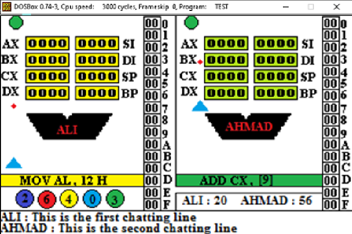

# Assembly 8086 Processor Simulator Game
This game is an assembly simulator that allows two players connected through a serial network to simulate the behavior of 8086 processor. It is intended to be used as a tool for learning, practicing, and testing assembly programming skills.

## How to Play
Players write assembly commands in the game that are executed on the opponent's simulated 8086 processor. The player can then observe the state of the processor's registers and memory after each instruction is executed. The final target for each player is to put certain value in one of the opponent registers. Each player should prevent the opponent from reaching the required value using assembly commands and special types of power-ups. This allows the player to gain a deeper understanding of the inner workings of a processor and how assembly instructions affect its behavior.

## Game Flow Scenario
1. Assuming the two players are Ahmed and Ali. Ahmed initiated the game.
2. Initial points screen appears asking both players to choose the initial points.
3. Ahmed choses the initial point to be 70 and Ali chooses it to be 60. Initial points for both players start at 60 because it is the lower number.
4. Level selection screen appears to Ahmed only. Ahmed selected level 1.
5. The forbidden character selection screen appears for both players.
6. Ahmed chooses ‘M’ as a forbidden character while Ali chooses ‘0’ as a forbidden character. The character appears on both screens.
7. As both of them enter their forbidden character, the main game screen appears for both players as shown in the figure with all registered initialized by zeros.

8. Ahmed wants to start by writing “Mov ax, 105e”. He will not be able to write this command because Ali forbids him from using the character “0”. Ahmed wrote the command “Mov AX, FFF”. For simplicity, all numbers are in hexadecimal format without “H”.

9. The command executed at Ali’s processor and Ali’s AX register contains the value “0FFF”.

10. In Ali’s turn, He wants to write Mov Ax,105e but he is forbidden from the character “M”. In addition, He knows that if Ahmed writes “add ax,5F” as his next instruction he will be the winner. Therefore, he must use one of the available special power ups.

11. Five types of power ups are available:
- Executing a command on your own processor (consumes 5 points)
- Executing a command on your processor and your opponent processor at the same time (consumes 3 points)
- Changing the forbidden character only once (consumes 8 points)
- Making one of the data lines stuck at zero or at one for a single instruction (consumes 2 points)
- Clearing all registers at once. (Consumes 30 points and could be used only once).
12. Ali chose the fourth power up and entered 3 as the line number and zero as the sticking value to be zero. In this case, if Ahmed wrote the command “add ax,5F” it will be converted to “Add ax,57” Note that “F” converted to “7” because “F” = 1111 while the line number 3 is stuck at zero it will be equal to 0111 = 7. In addition to choosing the power up, Ali entered the following command “Mov BX,AL”. This command is invalid. Therefore, Ali loses one point, the command is not executed on Ahmed’s processor and Ali loses his turn.

13. Five types of errors could be detected:
- Size mismatch
- Memory to memory operation
- Invalid register name
- Pushing 8 bits
- Incorrect addressing mode like “mov ax, [CX]”
14. If any player's points reach zero s/he loses.

15. Flying objects appear randomly at both screens at the same time. Each player tries to shoot it using a gun. Based on the object color it gives the players a certain number of points i.e. green object gives the player one point, blue object gives the player two points … etc. The gun is moved using arrows and shooting using a space bar. Colored circles with a number inside it determines the numbers of hit flying objects.
16. For the second level, all rules of the first level are applied in addition to the following rules:
- The forbidden character is hidden. Any command including the forbidden character will not be executed. Each player should deduce the forbidden character through non executed commands.
- For each command, each player is able to decide whether to execute it on his/her processor or the opponent processor.
- Each player should be able to put initial values for any register at the beginning of the level.
- An extra power up is introduced, letting each player be able to change the target value only once to any value other than values currently existing in any register for the two players.

## Features
- Fully functional processor simulator with support for common instructions, addressing modes, and common syntax errors detection.
- Memory viewer that allows players to examine the contents of memory and registers at any point during execution.
- Chat module that allows the two players to chat with each other during the game 

## Conclusion
The Assembly 8086 Processor Simulator Game is a valuable tool for anyone learning assembly programming or wanting to deepen their understanding of processor behavior. With its intuitive interface, powerful features, this game is the perfect way to gain hands-on experience with assembly programming in a fun and engaging way!

## Development 
This game was developed using assembly x86 language and a custom-built processor simulator. The source code for the game is available on for those who want to contribute or modify the game!